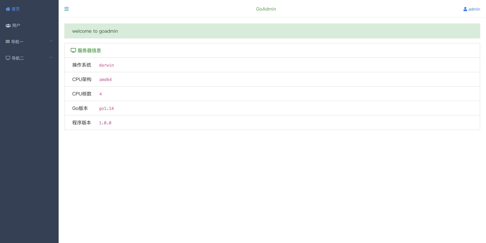
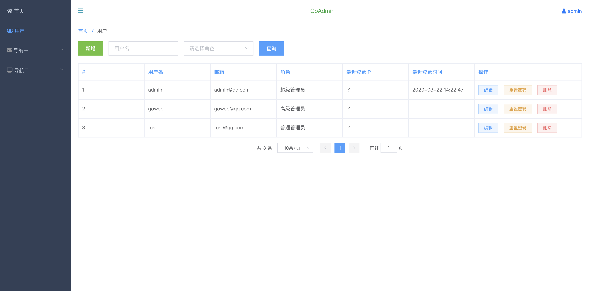

# goadmin

Go开发后台管理系统，将前端资源一起编译，是不是很酷？！

## Features

- 页面布局：[ElementUI](https://element.eleme.cn/#/zh-CN)
- Go开发库：[yiigo](https://github.com/iiinsomnia/yiigo)
- 编译前端资源：[go.rice](https://github.com/GeertJohan/go.rice)

## Requirements

`Go1.11+`

## Usage

- 下载 `goadmin` 并解压
- 执行 `go mod download`
- 创建数据库后导入 `goadmin.sql`
- 创建配置文件 `yiigo.toml` 并配置数据库连接，参考 `yiigo.toml.example`

#### 编译前端资源

- 安装 `go.rice` 工具，参考 [go.rice](https://github.com/GeertJohan/go.rice)
- 在 `assets` 与 `views` 目录下分别执行 `rice embed-go`
- 最后 `go build -o goadmin`

> 注意⚠️：
>
> 项目使用了 [gracehttp](https://github.com/facebookarchive/grace)，Windows下不支持，如需编译 Windows 版本，建议去掉
>
> 默认登录账号：admin admin